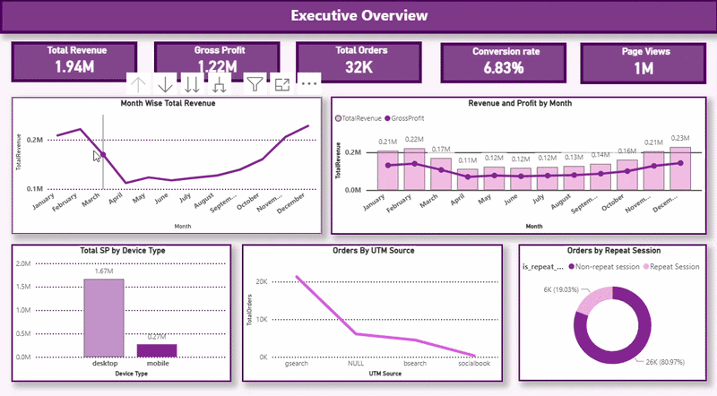

# VisitToValue — E-Commerce Analytics with Power BI

**VisitToValue** is an end-to-end e-commerce analytics project built using **Power BI** to analyze the complete customer journey — from website visits and engagement to conversion, purchase, and revenue generation.

The project uses the **Maven Fuzzy Factory** e-commerce dataset and focuses not only on dashboard creation, but also on **data preparation, data modeling, DAX calculations, analytical exploration, and business recommendations**.

The overall analytical journey is:

**Visit → Engagement → Conversion → Purchase → Value**

---

## 📊 Project Walkthrough
A walkthrough of the completed Power BI report.



---

## 🎯 Project Objective

The objective of VisitToValue was to build a Power BI analytics solution that answers key business questions across different stages of an e-commerce funnel.

The project explores:

* How much revenue and gross profit is being generated?
* How are website sessions converting into orders?
* Which devices perform better?
* Which marketing sources and campaigns contribute to orders and revenue?
* How does website engagement change over time?
* Which pages receive the most traffic?
* How do repeat and non-repeat sessions behave?
* Which products generate the most revenue and profit?
* How much revenue is being refunded?
* Where are the major opportunities for improving conversion, marketing performance, product discovery, and retention?

Rather than creating a single generic sales dashboard, the report was structured into multiple analytical perspectives.

---

# 🗂️ Dataset

The project uses the **Maven Fuzzy Factory** e-commerce dataset.

The dataset contains information related to:

* Website sessions
* Website pageviews
* Orders
* Order items
* Products
* Order item refunds

The complete source tables used in the project are included in the `Maven_Fuzzy_Factory_Data` folder.

---

# 🛠️ Tools & Technologies

* **Power BI**
* **Power Query**
* **DAX**
* **Data Modeling**
* **Data Transformation**
* **Data Visualization**
* **Business Intelligence**
* **Analytical Storytelling**

---

# 🔄 Project Workflow

The project was developed as an end-to-end analytics workflow:

**Data Import → Data Exploration → ETL & Transformation → Data Modeling → DAX → Visualization → Analysis → Insights → Recommendations**

---

# 1. Data Import & Exploration

The source dataset was imported into Power BI and explored to understand:

* Table structures
* Column types
* Primary and foreign key fields
* Date fields
* Session-level data
* Pageview-level data
* Order-level data
* Product-level information
* Refund information
* Transaction-level versus session-level granularity

The tables were reviewed before building the final data model so that calculations could be performed at the appropriate level of granularity.

---

# 2. ETL & Data Transformation

Data preparation was performed using **Power Query**.

The transformation process included:

* Reviewing imported tables and column structures
* Validating data types
* Preparing fields for analysis
* Cleaning and organizing the dataset
* Preparing date fields for time-based analysis
* Structuring tables for relationships
* Preparing the dataset for downstream DAX calculations
* Ensuring that session, pageview, order, product, and refund analysis could be performed consistently

Power Query was used as the transformation layer before loading the prepared data into the Power BI model.

---

# 3. Data Model

The report uses multiple related tables rather than treating the dataset as one flat table.

## Main Tables

| Table                | Purpose                                     |
| -------------------- | ------------------------------------------- |
| `website_sessions`   | Website session and traffic information     |
| `website_pageviews`  | Individual pageview activity                |
| `orders`             | Order-level transaction information         |
| `order_items`        | Individual products purchased within orders |
| `products`           | Product information                         |
| `order_item_refunds` | Refund information at order-item level      |

## Relationships

The model includes relationships such as:

```text
website_sessions
       │
       ├─────────────── website_pageviews
       │
       └─────────────── orders
                           │
                           └─────────────── order_items
                                                │
                                                └─────────────── order_item_refunds

products
    │
    └─────────────── order_items
```

The relationships were designed according to the level at which each table records information.

For example:

* One website session can contain multiple pageviews.
* One website session can result in an order.
* One order can contain multiple order items.
* One product can appear across multiple order items.
* An order item can have associated refund information.

This model allows the analysis to move from high-level website activity to transaction and product-level analysis.

---

# 4. DAX & Analytical Measures

DAX was used to create measures and calculations required for the analysis.

## Total Sessions

```DAX
TotalSessions =
DISTINCTCOUNT(website_sessions[website_session_id])
```

## Total Orders

```DAX
TotalOrders =
DISTINCTCOUNT(orders[order_id])
```

## Total Revenue

```DAX
TotalRevenue =
SUM(orders[price_usd])
```

## Profit

A calculated column was created to calculate order-level profit:

```DAX
Profit =
orders[price_usd] - orders[cogs_usd]
```

## Conversion Rate

```DAX
Conversion Rate =
DIVIDE(
    [TotalOrders],
    [TotalSessions],
    0
)
```

## Total Page Views

```DAX
TotalPageViews =
DISTINCTCOUNT(website_pageviews[website_pageview_id])
```

## Product-Level Calculations

Additional calculations were created for product-level analysis, including:

* Product Revenue
* Product COGS
* Product Gross Profit
* Product Gross Margin %
* Refund Amount
* Units Sold

The calculations were designed according to the appropriate table granularity.

For example, overall order revenue is calculated from the `orders` table, while product-level revenue is analyzed through `order_items`.

---

# 5. Report Structure

The Power BI report contains **5 analytical pages**.

---

# 📌 Page 1 — Executive Overview

The Executive Overview provides a high-level view of overall business performance.

## KPIs

* Total Revenue
* Gross Profit
* Total Orders
* Conversion Rate
* Page Views

## Analysis Included

* Monthly order trends
* Revenue by device type
* Revenue and gross profit trends
* Orders by session type
* Orders by marketing source

## Key Observations

The analysis shows:

* Approximately **$1.94M total revenue**
* Approximately **$1.22M gross profit**
* More than **473K sessions**
* More than **32K orders**
* Approximately **6.83% conversion rate**
* Approximately **$1.67M revenue from desktop**

December represented the strongest period across several activity and performance measures.

---

# 📌 Page 2 — Marketing Performance

This page focuses on the relationship between website traffic, marketing sources, devices, and revenue.

## Analysis Included

* Revenue by UTM source
* Revenue by UTM campaign
* Orders by month and UTM source
* Orders by device type and UTM source
* Sessions by month
* Sessions by UTM content
* Sessions versus revenue by UTM source

## Key Observations

The analysis highlighted:

* **gsearch** as the strongest source by order volume
* Strong performance from the **Brand** campaign
* Differences in marketing performance across device types
* The importance of evaluating marketing sources using more than just order count

The page uses multiple visual types, including charts, a ribbon chart, slicers, and a scatter plot to compare traffic and commercial outcomes.

---

# 📌 Page 3 — Website & Conversion Analysis

This page examines the website journey from pageviews to sessions and orders.

## Analysis Included

* Website activity funnel
* Pageviews by URL
* Conversion rate by device
* Pageviews by repeat-session status
* Monthly pageview trends
* Interactive filtering

## Key Observations

The website generated approximately:

* **1.188M pageviews**
* **473K sessions**
* **32K orders**

A significant device-level conversion difference was observed:

| Device  | Conversion Rate |
| ------- | --------------: |
| Desktop |          ~8.50% |
| Mobile  |          ~3.09% |

The `/products` page received the highest number of pageviews, with approximately **261K pageviews**.

This highlighted potential opportunities around mobile conversion and product discovery/navigation.

---

# 📌 Page 4 — Product & Revenue Analysis

This page focuses on product-level commercial performance.

## Analysis Included

* Product revenue
* Product gross profit
* Product gross margin
* Refund amount
* Units sold
* Monthly product gross profit
* Product-level revenue and refunds

## Key Observations

The analysis identified:

* Approximately **$1.94M product revenue**
* Approximately **$85.34K refund amount**
* Approximately **63% overall product gross margin**
* **The Original Mr. Fuzzy** as the highest-volume product, with approximately **24,226 units sold**

The page combines product-level profitability, revenue, refund, and volume analysis to provide a broader view of product performance.

---

# 📌 Page 5 — Key Insights & Recommendations

The final page translates the analysis into business-focused findings.

Instead of adding more charts, this page answers:

> **So what does the analysis tell us?**

---

## 1. Seasonal Performance

December showed the strongest overall activity across several measures, including revenue, sessions, pageviews, and gross profit.

### Recommendation

Plan campaigns, inventory, and promotional activity ahead of high-performing seasonal periods.

---

## 2. Desktop Conversion Advantage

Desktop generated approximately **$1.67M revenue** and had an approximately **8.50% conversion rate**, compared with approximately **3.09% on mobile**.

### Recommendation

Investigate the mobile user journey, product browsing experience, and checkout flow to identify potential conversion barriers.

---

## 3. Search-Led Orders

The analysis showed strong order contribution from **gsearch**, with the **Brand** campaign also performing strongly.

### Recommendation

Continue monitoring high-performing search campaigns while evaluating channels using revenue, conversion, and profitability rather than order volume alone.

---

## 4. Non-Repeat Session Opportunity

A large proportion of orders were associated with non-repeat sessions, indicating an opportunity to strengthen retention and re-engagement.

### Recommendation

Explore retention strategies such as remarketing, personalized offers, and post-purchase engagement.

> **Note:** `is_repeat_session` is a session-level attribute and should not automatically be interpreted as a new-versus-returning customer classification.

---

## 5. Product Discovery

The `/products` page received the highest number of pageviews, with approximately **261K pageviews**.

### Recommendation

Optimize product listing, filtering, navigation, and product discovery experiences.

---

## 6. High-Volume Product

The Original Mr. Fuzzy recorded approximately **24,226 units sold**, making it the highest-volume product in the analysis.

### Recommendation

Use high-volume products as candidates for deeper analysis of revenue, margin, refunds, and customer behavior.

---

# 📊 Key Metrics

| Metric                    |                                  Value |
| ------------------------- | -------------------------------------: |
| Total Sessions            |                                  ~473K |
| Total Pageviews           |                                ~1.188M |
| Total Orders              |                                   ~32K |
| Total Revenue             |                                ~$1.94M |
| Gross Profit              |                                ~$1.22M |
| Conversion Rate           |                                 ~6.83% |
| Refund Amount             |                               ~$85.34K |
| Product Gross Margin      |                                   ~63% |
| Highest Device Revenue    |                      Desktop — ~$1.67M |
| Highest Device Conversion |                       Desktop — ~8.50% |
| Highest-Volume Product    | The Original Mr. Fuzzy — ~24,226 units |
| Highest-Activity Month    |                               December |

---

# 💡 Business Questions Addressed

## Traffic & Engagement

* How much website traffic is being generated?
* How does website activity change over time?
* Which pages attract the most attention?
* How do repeat and non-repeat sessions differ?

## Conversion

* How many sessions convert into orders?
* Which device performs better?
* Where might conversion opportunities exist?

## Marketing

* Which UTM sources generate the most orders?
* Which campaigns contribute most to revenue?
* Are high-traffic sources also generating strong commercial outcomes?

## Product

* Which products sell the most units?
* Which products contribute to revenue and gross profit?
* How much revenue is being refunded?
* Which products may require deeper profitability analysis?

## Business Decision-Making

* When are the strongest periods?
* Where are conversion gaps?
* Which marketing channels deserve closer monitoring?
* Where can product discovery and customer retention be improved?

---

# 🎨 Analytical Storytelling

The report was structured as an analytical story rather than a collection of unrelated charts.

The pages progress from:

**Executive Performance**

↓

**Marketing Performance**

↓

**Website & Conversion**

↓

**Product & Revenue**

↓

**Insights & Recommendations**

This structure moves from:

**What happened → Where it happened → What it means → What could be done next**

---

# 📁 Repository Structure

```text
VisitToValue-E-Commerce-Analytics/
│
├── README.md
├── Recording.gif
├── VisitToValue.pbix
│
└── Maven_Fuzzy_Factory_Data/
    ├── maven_fuzzy_factory_data_dictionary.csv
    ├── order_item_refunds.csv
    ├── order_items.csv
    ├── orders.csv
    ├── products.csv
    ├── website_pageviews.csv
    └── website_sessions.csv
```

---

# 🔐 Usage & Attribution

**VisitToValue is an original Power BI project created by Gurleen Kaur Bali.**

The `.pbix` file is included in this repository to allow recruiters, hiring managers, and other viewers to inspect the Power BI implementation, including the data model, Power Query transformations, DAX calculations, report structure, and visualizations.

The repository is publicly available for **portfolio and professional evaluation purposes**.

### Please do not:

* Present this project or any substantial part of it as your own work.
* Submit this project as part of an interview assignment, assessment, academic submission, or professional deliverable under your own name.
* Re-upload the `.pbix` file or the complete project to another repository as your own.
* Copy the report structure, DAX calculations, analysis, insights, or recommendations and claim authorship.
* Remove or alter the original author attribution when redistributing or referencing substantial portions of the project.

If you use or reference this project, please provide clear attribution to **Gurleen Kaur Bali** and link back to this repository.

### Important

The inclusion of the `.pbix` file is intended to demonstrate the author's Power BI implementation and technical work. It does **not** grant permission to represent the project as someone else's work.

---

# 👩‍💻 Author

**Gurleen Kaur Bali**

**Data Analytics | Power BI | SQL | Python**

GitHub: [@gurleenkaurbali19](https://github.com/gurleenkaurbali19)

---

# 📌 Disclaimer

This project uses a publicly available e-commerce dataset for analytical and portfolio purposes.

The business recommendations presented in this project are analytical interpretations based on the available dataset and should not be treated as actual recommendations made to the original business.
